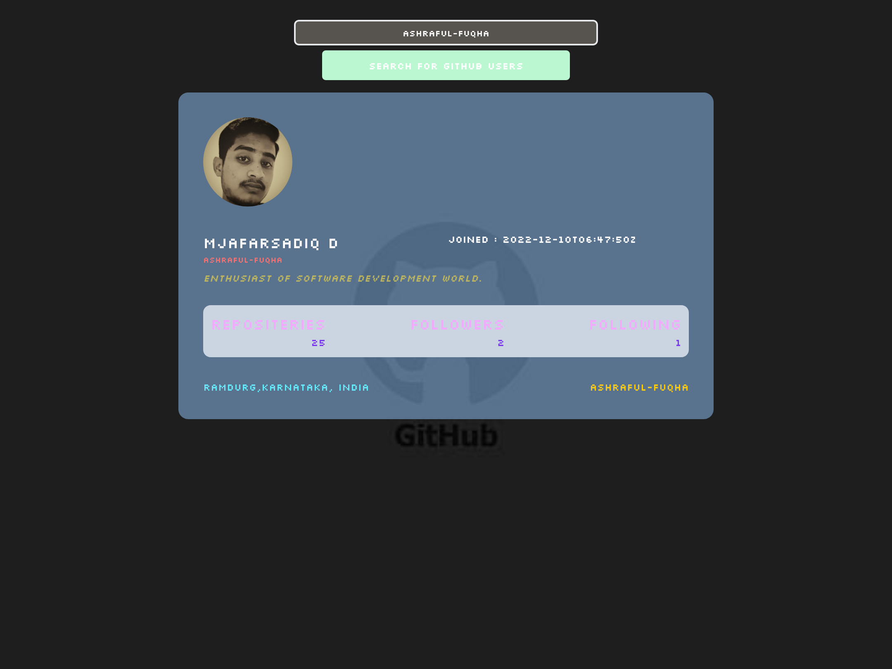

# GitHub User Search

This Challenge [GitHub User Search]() given by me to me solved by me 😂.

## Table of contents

- [Overview](#overview)
  - [The challenge](#the-challenge)
  - [Screenshot](#screenshot)
  - [Links](#links)
- [My process](#my-process)
  - [Built with](#built-with)
- [Author](#author)

## Overview

### The challenge

Users should be able to:

- Search his desired repository base on his Login Username.
### Screenshot

### Links

- Solution URL: [Solution URL here](https://www.github.com/Ashraful-Fuqha/github-user-search/)
- Live Site URL: [Live site URL here](https://ashraful-fuqha.github.io/github-user-search/)

## My process

### Built with

- Semantic HTML5 markup
- Flexbox
- TailwindCSS 
- Vanilla JS
- GitHub User API

## Author

- Website - Definetly
- GitHub - [@MjafarsadiqD](https://github.com/Ashraful-Fuqha)